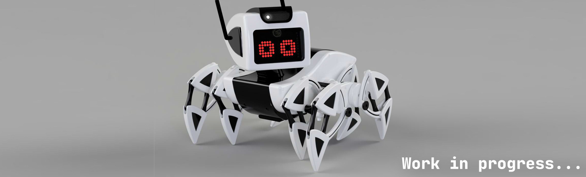

# 🌐 CreepyMemes

 

### About Me

I am currently studying Software and Automation Engineering at university.

### Interests

- **Competitive Programming**: I enjoy competitive programming challenges as they enhance my skills in data structures and algorithms, sharpen my critical thinking, and improve my problem-solving efficiency.

- **Capture The Flag**: I completed a cybersecurity course by [Cyberchallenge.IT](https://www.cyberchallenge.it/), culminating in a CTF competition. As one of the local winners, I advanced to the nationals, greatly enhancing my cybersecurity knowledge.

- **Personal Project**: I have a passion for robotics and I am currently working on an AI-based robotics project _(featured in the banner above)_. This project has enabled me to integrate many skills and technologies, including:

  - **Electronics and Circuit Design**: Applying the basics of electronics and circuit design.
  - **CAD Modeling and 3D Printing**: Prototyping through CAD and 3D printing techniques
  - **Embedded Firmware Programming**: Writing firmware for microcontroller control.
  - **Web Development**: Creating a full-stack interactive interface.
  - **Cybersecurity**: Securing the internet-exposed server.

### 📝 Languages that I work with:

 

#

### 🛠️ Tools that I use:

 

#

### 💻 OS's where I do my work in:

 

#

### 📊 GitHub Stats:

