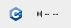
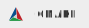
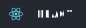
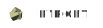
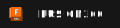
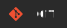

<h1 align="center">Hi there, I'm CreepyMemes 👋</h1>

  
  
  

<h3 align="center">I'm studying Software and Automation Engineering and working on a robotics project in my spare time, which you can see in the banner above.</h3>

<h2 align="left">🌟Interests:</h2>

- 🖥️ Fullstack Web Dev
- 🔒 Cybersecurity & CTF
- 🗄️ Self-Hosting & Homelabs
- ⚙️ Systems & Infrastructure Engineering
- 🤖 AI Engineering
- 📟 Embedded Programming
- ⚡ Electronics
- 📐 CAD Designing
- 🖨️ 3D Printing
- 🧮 Mathematics
- ⚛️ Physics

 

<h2 align="left">🖥️Languages</h2>

  
  
  
  
  
  
  
  
  

 

<h2 align="left">🧩Frameworks </h2>

  
  
  
  
  

 

<h2 align="left">🔧Tools </h2>

  
  
  
  
  
  
  
  
  
  
  

 

<h2 align="left">♾️DevOps </h2>

  
  
  
  
  
  

 

<h2 align="left">⚙️OS </h2>

  
  
  

 

<h3 align="center"> 📊Statistics</h2>

 &nbsp;

  

